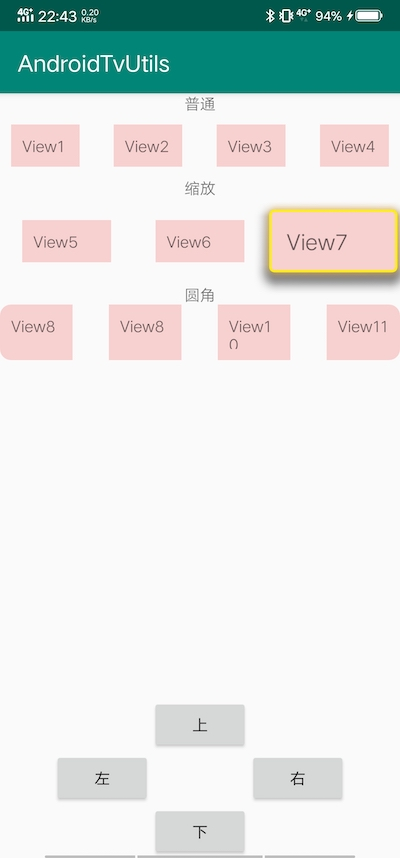

# AndroidTvUtils
## Android电视开发帮助工具
* 滑动焦点框
##### 图片必须是.9图使用焦点框的页面根布局不能是LinearLayout
##### 支持滑动过程中修改焦点图片
##### 支持在页面被弹出层遮挡pause时调暗焦点框
##### 支持修改移动速度及插值器
##### 使用简单
```java
    FocusUtils focusUtils = new FocusUtils(this, view, R.drawable.image_focus);
    focusUtils.startMoveFocus(newFocus);
```

、、、
* view缩放
* 圆角view
##### *可安装项目中的demo.apk体验*


